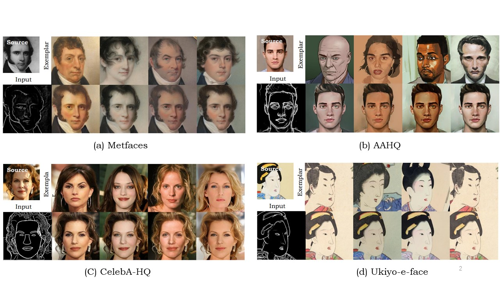
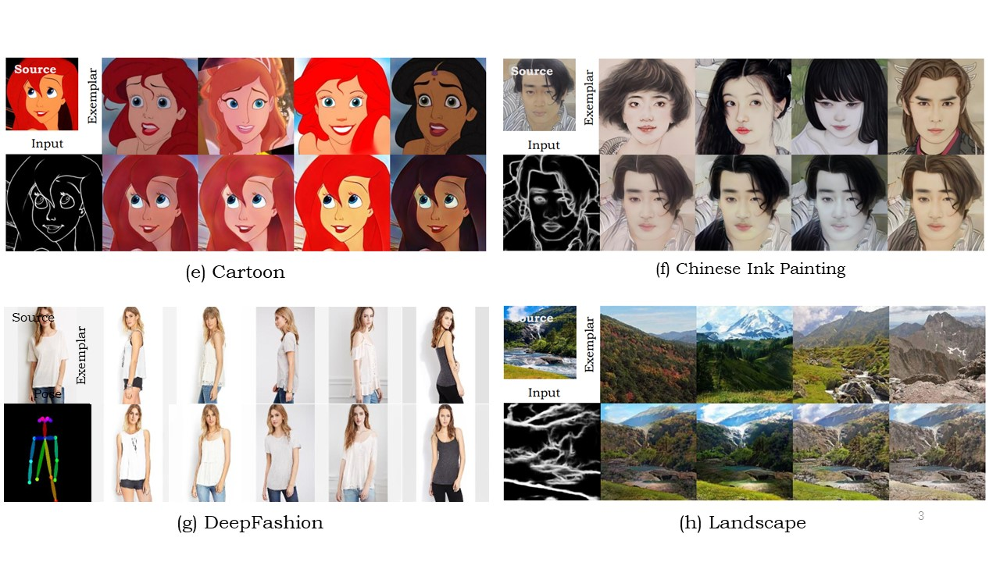

# CVPR2023 “Masked and Adaptive Transformer for Exemplar Based Image Translation" (MATEBIT)

## Abstract

​	We present a novel framework for exemplar based image translation. Recent advanced methods for this task mainly focus on establishing cross-domain semantic correspondence, which sequentially dominates image generation in the manner of local style control. Unfortunately, cross-domain semantic matching is challenging; and matching errors ultimately degrade the quality of generated images. To overcome this challenge, we improve the accuracy of matching on the one hand, and diminish the role of matching in image generation on the other hand. To achieve the former, we propose a masked and adaptive transformer (MAT) for learning accurate cross-domain correspondence, and executing context-aware feature augmentation. To achieve the latter, we use source features of the input and global style codes of the exemplar, as supplementary information, for decoding an image. Besides, we devise a novel contrastive style learning method, for acquire quality-discriminative style representations, which in turn benefit high-quality image generation. 

## Paper Information

Chang Jiang, **Fei Gao**, Biao Ma, Yuhao Lin, Nannan Wang, Gang Xu, "**Masked and Adaptive Transformer for Exemplar Based Image Translation**," *IEEE CVPR*, accepted, 2023. [[paper_arxiv\]](https://arxiv.org/abs/2303.17123) ~ [[project\]](https://github.com/AiArt-HDU/MATEBIT)


## Sample Results

- **same results:**





- **More Results:**

We offer more results here: https://drive.google.com/drive/folders/1t2U82eDvqd1-xKigBs_GnnVRemdoYOpR

## Prerequisites

- Linux or macOS
- Python 3.8
- Pytorch 1.8
- CPU or NVIDIA GPU + CUDA CuDNN

## Getting Started

## Preparation

- Clone this repo:

  ```
  git clone https://github.com/AiArt-HDU/MATEBIT
  cd MATEBIT
  ```

- **VGG model** for computing loss. Download from  [here](https://drive.google.com/file/d/1fp7DAiXdf0Ay-jANb8f0RHYLTRyjNv4m/view),  move it to models/

- for the preparation of datasets.please refer to [CocosNet](https://github.com/microsoft/CoCosNet)

## Pretrained Models

- The [pre-trained model](https://drive.google.com/drive/folders/1t2U82eDvqd1-xKigBs_GnnVRemdoYOpR) need to be save at `./checkpoint`

### Train/Test

#### 1) Celeba(edge-to-face)

- **Dataset** Download from [here](https://drive.google.com/file/d/1badu11NqxGf6qM3PTTooQDJvQbejgbTv/view).

- **Retrieval_pairs** same as **Celebahq (edge-to-face)**

- **Train_Val split** same as **Celebahq (edge-to-face)**

-  Run the following command. Note that `dataset_path` is your celebahq root, e.g. `/data/Dataset/CelebAMask-HQ`.  

  ```
  python train.py --name celebahqedge --dataset_mode celebahqedge --PONO --PONO_C --amp --batchSize 4 --netG dynast --load_size 286 --crop_size 256 --dataroot root_path --contrastive_weight 100.0 --label_nc 15 --niter 30 --niter_decay 30 --gpu_ids 0 --use_atten --vgg_normal_correct --style_weight 0.1  --weight_warp_self 1000.0 --weight_perceptual 0.001 --vgg_path vgg/vgg19_conv.pth --continue_train 
  ```

  ```
  python test.py --name celebahqedge --dataset_mode celebahqedge --PONO --PONO_C --amp --batchSize 4 --netG dynast --load_size 256 --crop_size 256 --dataroot root_path --no_flip --which_epoch latest --save_per_img
  ```


#### 2) DeepFashion (pose-to-image)

- **Dataset** Download [DeepFashion](https://drive.google.com/drive/folders/0B7EVK8r0v71pVDZFQXRsMDZCX1E), we use [OpenPose](https://github.com/Hzzone/pytorch-openpose) to estimate pose of DeepFashion. Download and unzip [openpose results](https://drive.google.com/file/d/1Vzpl3DpHZistiEjXXb0Blk4L12LsDluU/view?usp=sharing), then move folder `pose/` to `DeepFashion/`

- **Retrieval_pairs** Download `deepfashion_ref.txt`, `deepfashion_ref_test.txt` and `deepfashion_self_pair.txt` from [here](https://drive.google.com/drive/folders/1FEMuwWZqk_cuzl7HSSbCrtl1ynIE0zIE?usp=sharing), save or replace them in `data/`

- **Train_Val split** Download `train.txt` and `val.txt` from [here](https://drive.google.com/drive/folders/1kLOeRYZ1wUDzo3eg9ZihJj-yuyDQhp_T?usp=sharing), save them in `DeepFashion/`

  ```
  python train.py --PONO --PONO_C --no_flip --video_like --vgg_normal_correct  --video_like  --nThreads 40 --amp --display_winsize 256 --load_size 286  --crop_size 256  --label_nc 3 --batchSize 80  --gpu_ids 0,1,2,3,4,5,6,7 --netG dynast --niter 100 --niter_decay 100 --vgg_path vgg/vgg19_conv.pth --n_layers 3 --use_atten --contrastive_weight 100.0 --style_weight 0.2 --weight_perceptual 0.01 --continue_train --display_freq 5000
  ```

  ```
  python test.py --PONO --PONO_C --no_flip --video_like --vgg_normal_correct  --video_like  --nThreads 16 --amp --display_winsize 256 --load_size 286  --crop_size 256  --label_nc 3 --batchSize 4 --which_epoch latest --save_per_img 
  ```

#### 3) Other datasets

- **Download**  [Metfaces](https://github.com/NVlabs/metfaces-dataset ) [AAHQ](https://github.com/onion-liu/aahq-dataset  ) [Ukiyo-e faces](https://www.justinpinkney.com/ukiyoe-dataset/  )

- **Brush painting, traditional art painting**

  We obtained a dataset of 915 traditional Chinese brush paintings with a resolution of 512 size from the Internet. https://drive.google.com/file/d/1sBH59nIzZaXik9R1EOzrFCgFNXdNivit/view

  [retrieve similar reference image](https://github.com/microsoft/CoCosNet/issues/10), After making the labels, you can train the rest of the dataset.

## Citation

 If you use this code for your research, please cite our paper. 

```
@inproceedings{jiang2023masked,
  title={Masked and Adaptive Transformer for Exemplar Based Image Translation},
  author={Jiang, Chang and Gao, Fei and Ma, Biao and Lin, Yuhao and Wang, Nannan and Xu, Gang},
  booktitle={Proceedings of the IEEE/CVF Conference on Computer Vision and Pattern Recognition},
  pages={22418--22427},
  year={2023}
}
```

## Acknowledgments

This code borrows heavily from [DynaST](https://github.com/Huage001/DynaST) and [MMTN](https://ieeexplore.ieee.org/document/9781402). We also thank the implementation of [Synchronized Batch Normalization](https://github.com/vacancy/Synchronized-BatchNorm-PyTorch). 

